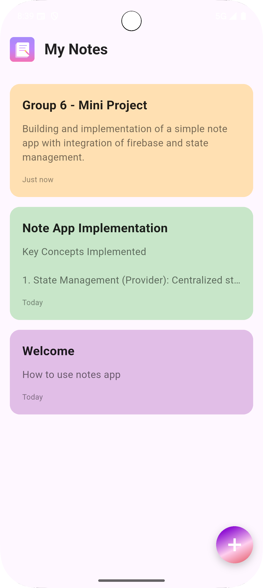
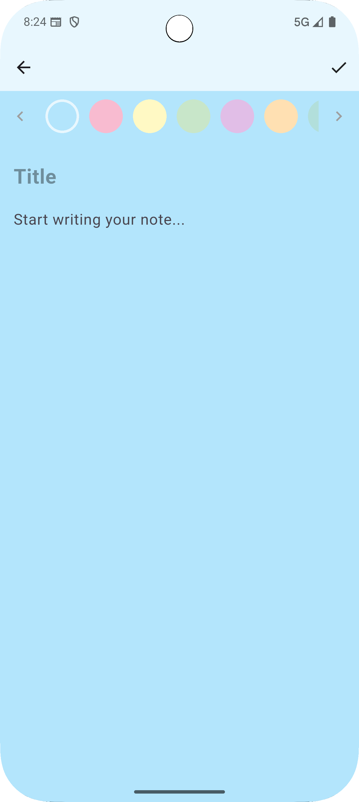
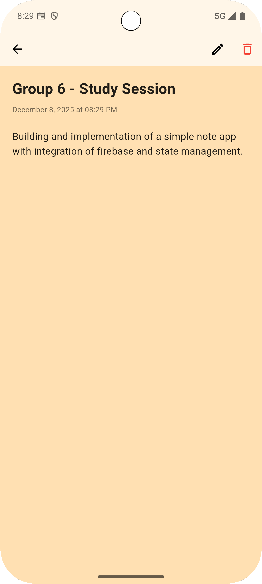
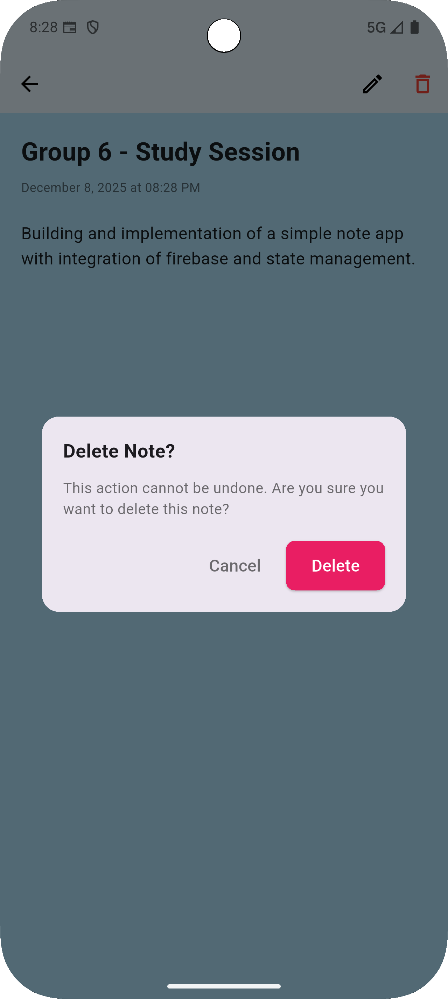

# Note App

A comprehensive Flutter-based Note Taking application that leverages Firebase for real-time data synchronization. This app provides a seamless experience for creating, updating, viewing, and deleting notes across devices.

## Features

-   **Create Notes**: Easily add new notes with titles and content.
-   **Edit & Update**: Modify existing notes to keep your information current.
-   **Delete Notes**: Remove unwanted notes to keep your list organized.
-   **Real-time Sync**: Uses **Firebase Cloud Firestore** to sync notes instantly across devices.
-   **State Management**: efficient state handling using the **Provider** package.

## Screenshots

<div style="display: flex; gap: 10px; overflow-x: auto;">
    
    
    
    
  
</div>

## Tech Stack

This project is built using the following technologies:

-   **[Flutter](https://flutter.dev/)**: Google's UI toolkit for building natively compiled applications.
-   **[Dart](https://dart.dev/)**: The programming language used for Flutter development.
-   **[Firebase](https://firebase.google.com/)**:
    -   **Cloud Firestore**: NoSQL cloud database for storing and syncing data.
    -   **Firebase Core**: Initialization and configuration for Firebase services.
-   **[Provider](https://pub.dev/packages/provider)**: A wrapper around InheritedWidget to make them easier to use and reusable.
-   **[json_serializable](https://pub.dev/packages/json_serializable)**: Automating JSON serialization and deserialization.

## Getting Started

To run this project locally, follow these steps:

### Prerequisites

-   [Flutter SDK](https://docs.flutter.dev/get-started/install) installed on your machine.
-   An IDE like [VS Code](https://code.visualstudio.com/) or [Android Studio](https://developer.android.com/studio).
-   A connected device or emulator/simulator.

### Installation

1.  **Clone the repository:**

    ```bash
    git clone <repository-url>
    cd note_app
    ```

2.  **Install dependencies:**

    ```bash
    flutter pub get
    ```

3.  **Firebase Setup:**
    
    This app requires a Firebase project.
    - Create a new project in the [Firebase Console](https://console.firebase.google.com/).
    - Configure the Android and iOS apps in your Firebase project.
    - Download the `google-services.json` (for Android) and `GoogleService-Info.plist` (for iOS) and place them in their respective directories (`android/app/` and `ios/Runner/`).
    - *Note: If `firebase_options.dart` is used, ensure it is configured for your project.*

4.  **Run the App:**

    ```bash
    flutter run
    ```

## Folder Structure

A brief look at the top-level directory structure:

```
lib/
├── data/           # Data layer components
├── models/         # Data models (Note, etc.)
├── pages/          # UI Screens (NoteList, CreateEdit, View)
├── provider/       # State management providers
├── services/       # External services (Firebase API, etc.)
├── utils/          # Helper functions and constants
├── widgets/        # Reusable UI components
└── main.dart       # App entry point
```

## Contributing

Contributions are welcome! If you have any suggestions or improvements, please fork the repository and submit a pull request.
